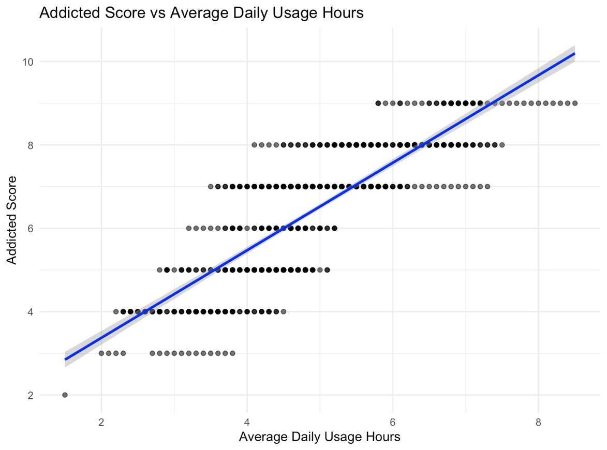
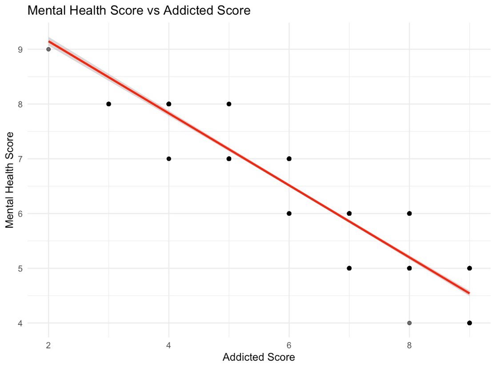
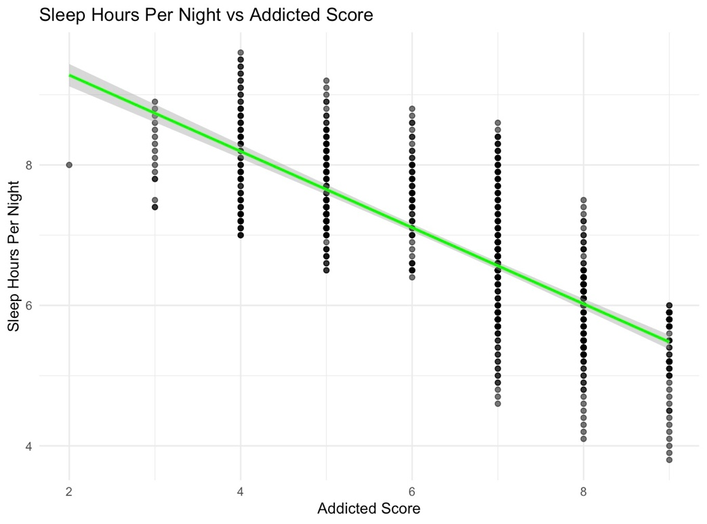

# Social media addiction, mental health, and sleep

How social media use relates to addiction, and how addiction relates to students' mental health and sleep.

**Type:** Regression and hypothesis testing · **Completed:** June 2025 · Northeastern University (ALY 6010)

[← All projects](../)

## What this project is about

This project investigates whether time spent on social media predicts addiction among students, and whether addiction is linked to poorer mental health and less sleep. It was completed in two stages: a set of hypothesis tests (Milestone 2), followed by a regression study (final report).

## Why it matters

Students spend hours a day on social media, and schools and counselors want to know whether that time is linked to real harm. This project puts numbers on those links: how strongly usage predicts addiction, and how strongly addiction tracks with mental health and sleep. Clear evidence like this is what supports digital-wellness programs and conversations with students about their habits.

## Dataset

**Students Social Media Addiction** (`Students Social Media Addiction.csv`): a survey of 705 students aged 18 to 24 from several countries, with age, gender, academic level, country, most-used platform, daily usage hours, sleep hours, mental health score, addiction score (2 to 9), and whether students feel social media affects their academic performance.

## What I did

I completed this project on my own, from cleaning the data through to the final report.

1. Cleaned and standardized the data, including column names, data types, and yes/no answers.
2. Explored the key variables with summary statistics and scatter plots.
3. **Milestone 2:** ran three t-tests on academic impact, sleep against the recommended 7 hours, and gender differences.
4. **Final report:** tested three relationships with Pearson correlation and simple linear regression: usage and addiction, addiction and mental health, and addiction and sleep.

## Results

- Students averaged about 4.9 hours a day on social media, ranging from 1.5 to 8.5 hours.
- **Usage predicts addiction:** each extra hour of daily use added about 1 point to the addiction score (r = 0.83, R² = 0.69, p < 0.001).

- **Addiction and mental health:** each point of addiction was linked to a 0.66-point drop in mental health score (r = −0.95, R² = 0.89, p < 0.001).

- **Addiction and sleep:** each point of addiction was linked to about half an hour less sleep per night (r = −0.76, R² = 0.58, p < 0.001).

- **Academic impact:** students who felt social media hurt their studies scored much higher on addiction, 7.46 vs. 4.60 (p < 0.0001).
- **Sleep:** students averaged 6.87 hours, significantly below the recommended 7 (p = 0.001).
- **Gender:** there was no significant difference in addiction scores between female (6.52) and male (6.36) students (p = 0.19).

## Takeaways

- Heavy social media use is strongly tied to addiction, and addiction is strongly tied to poorer mental health and less sleep.
- These are associations from survey data, not proof of cause and effect.
- Gender made no meaningful difference, so efforts to encourage healthier habits should reach all students.

## Skills demonstrated

Survey data analysis, Pearson correlation, simple linear regression, one- and two-sample t-tests, hypothesis design, ggplot2 visualization, research write-up

## Files

- [`final_report.docx`](final_report.docx): Written report
- [`milestone2_report.docx`](milestone2_report.docx): Written report
- [`milestone2_t_tests.R`](milestone2_t_tests.R): R script
- [`regression_analysis.R`](regression_analysis.R): R script

## How to run it

Packages: `ggplot2`, `dplyr`

Download the Students Social Media Addiction dataset (available on Kaggle), place it in this folder as `Students Social Media Addiction.csv`, and run the scripts in R or RStudio.
