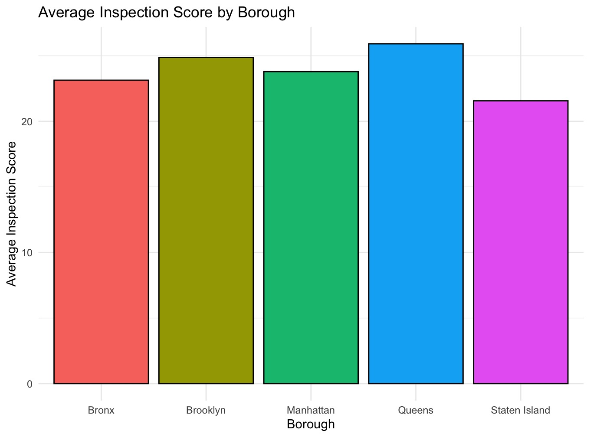
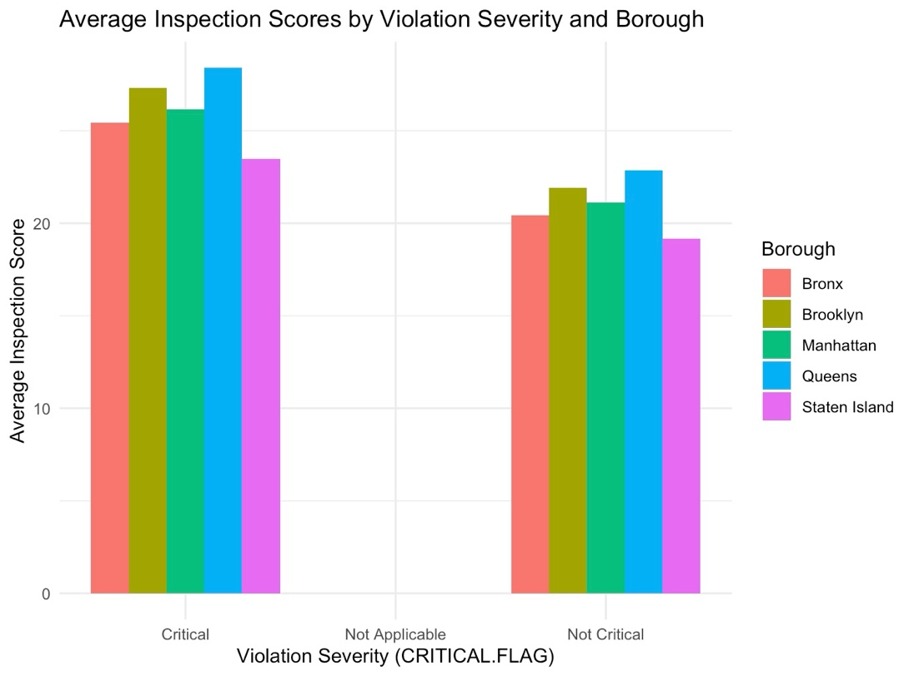

# NYC restaurant inspections: dummy-variable regression

Does location or violation severity drive restaurant inspection scores? Severity, by far.

**Type:** Regression · **Completed:** June 2025 · Northeastern University (ALY 6010)

[← All projects](../)

## What this project is about

This project analyzes New York City restaurant health inspections to see how scores vary by borough and how much critical violations drive them. In NYC, a higher inspection score means more or worse violations.

## Why it matters

New York's health department inspects tens of thousands of restaurants a year with limited inspectors. Knowing whether problems cluster by location or by the type of violation tells the city where to focus. This project shows that severity matters far more than borough, which points toward risk-based inspection rather than geographic targeting.

## Dataset

**Restaurant inspection results**, NYC Department of Health and Mental Hygiene: about 269,000 inspection records with valid scores across all five boroughs, with score, borough, critical-violation flag, inspection date, and cuisine.

## What I did

I completed this project on my own, from cleaning the data through to the final report.

1. Removed records with missing scores, boroughs, or placeholder dates.
2. Ran a regression of score on borough, using dummy variables with the Bronx as the reference.
3. Split the data into five borough subsets and ran a separate regression of score on violation severity in each.
4. Visualized scores by borough and by severity.

## Results

- The Bronx averaged 23.1. Compared with the Bronx, Queens scored 2.8 points higher, Brooklyn 1.7 higher, and Manhattan 0.7 higher, while Staten Island scored 1.6 lower. All of these differences were statistically significant.

- Borough explained very little of the variation in scores (R² = 0.004).
- In every borough, critical violations scored about 5 points higher than non-critical ones. Queens had the highest average score for critical violations, at 28.4.

## Takeaways

- Violation severity, not location, is what consistently drives inspection scores.
- For inspectors, that points to prioritizing restaurants with critical violations rather than targeting particular boroughs.

## Skills demonstrated

Dummy-variable regression, subset regression by group, working with a large public dataset (about 269,000 records), data cleaning, interpreting R² honestly

## Files

- [`report.docx`](report.docx): Written report
- [`restaurant_inspections_regression.R`](restaurant_inspections_regression.R): R script

## How to run it

Packages: `tidyverse`

Download the DOHMH New York City Restaurant Inspection Results from NYC Open Data, place the file in this folder, and run the script in R or RStudio.
