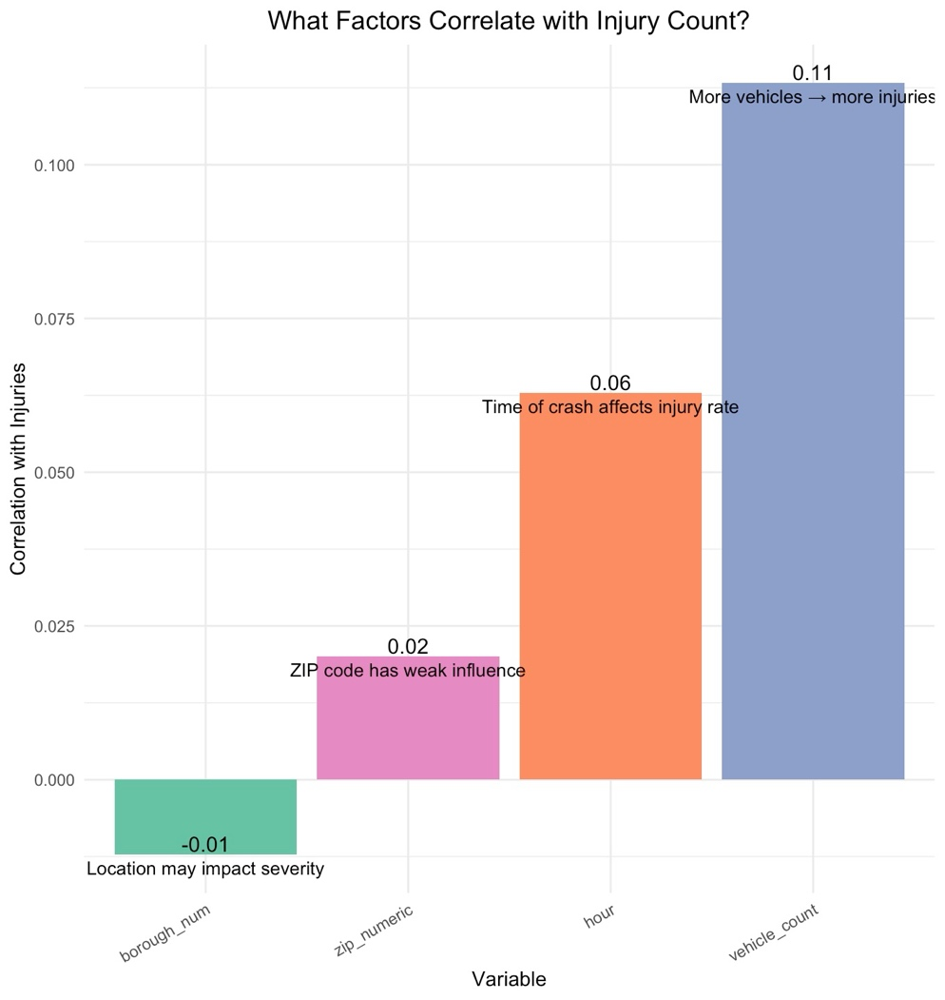

# NYC motor vehicle collisions: correlation and regression

What predicts how many people are injured in a New York City crash?

**Type:** Regression · **Completed:** June 2025 · Northeastern University (ALY 6010)

[← All projects](../)

## What this project is about

This project uses correlation and multiple regression on police-reported crashes in New York City to see which factors are linked to the number of people injured. The data comes from the city's traffic safety programs, including Vision Zero.

## Why it matters

New York's Vision Zero program aims to eliminate traffic deaths and serious injuries. Understanding which crash factors are tied to more injuries helps target enforcement, road design, and public campaigns. This project also shows something important about real-world data: a model can find significant effects and still explain only a small share of what happens.

## Dataset

**Motor Vehicle Collisions**, NYC Open Data (`h9gi-nx95.csv`): a sample of 100,000 NYPD-reported crashes. After cleaning, 65,602 complete records were used, with injury count, hour, number of vehicles, borough, and ZIP code.

## What I did

I completed this project on my own, from cleaning the data through to the final report.

1. Removed records with missing or invalid values and converted text fields to numbers.
2. Calculated correlations between injury count and four candidate predictors, and charted them.
3. Fit a multiple linear regression of injury count on vehicle count, hour, borough, and ZIP code.
4. Checked the model with a residual plot.

## Results

- Vehicle count had the strongest link to injuries (r = 0.11), followed by crash hour (r = 0.06). Borough and ZIP code had very weak links.

- In the regression, each additional vehicle added about 0.12 injuries on average, and all four predictors were statistically significant.
- Together the predictors explained only 1.8% of the variation in injuries (R² = 0.018).

## Takeaways

- Multi-vehicle crashes are more dangerous, and timing matters too.
- The low R² is reported as-is rather than hidden. Injuries depend heavily on things this dataset doesn't capture, like speed, driver behavior, and road conditions.

## Skills demonstrated

Correlation analysis, multiple linear regression, residual diagnostics, cleaning large messy public data, clear communication of model limitations

## Files

- [`nyc_crash_regression.R`](nyc_crash_regression.R): R script
- [`report.docx`](report.docx): Written report

## How to run it

Packages: `ggplot2`, `dplyr`, `tidyr`, `readr`, `lubridate`, `stringr`, `stargazer`, `RColorBrewer`, `plotly`

Download the Motor Vehicle Collisions dataset from NYC Open Data, save it as `h9gi-nx95.csv` in this folder, and run the script in R or RStudio.
