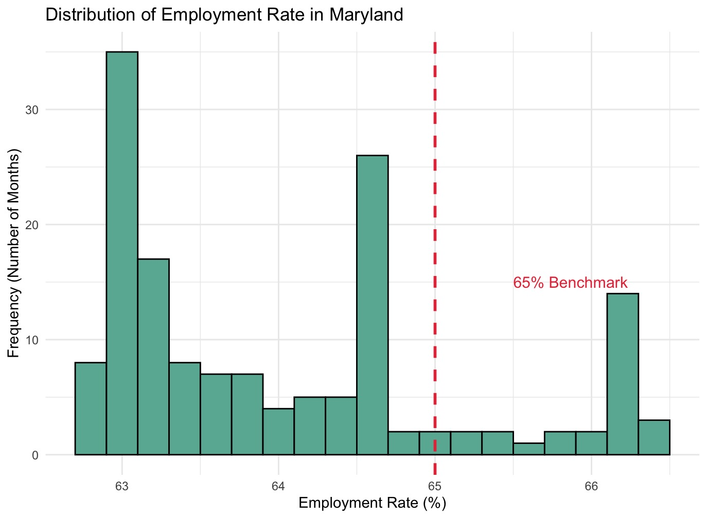
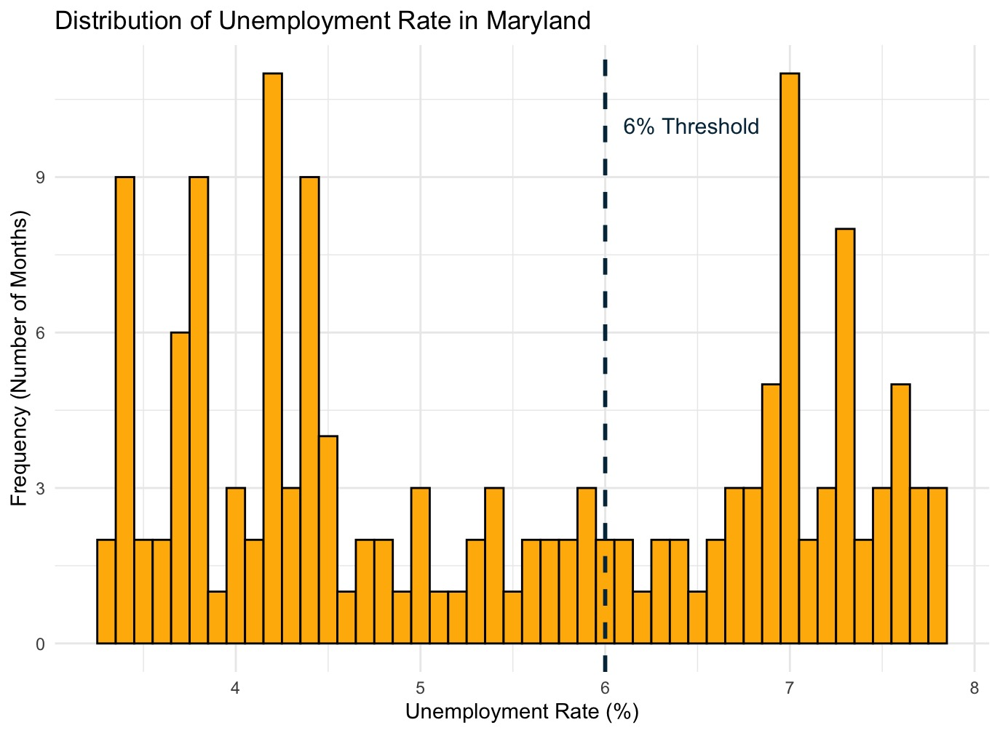

# Maryland labor market: hypothesis tests

Testing two assumptions about Maryland's job market, and finding both wrong.

**Type:** Hypothesis testing · **Completed:** June 2025 · Northeastern University (ALY 6010)

[← All projects](../)

## What this project is about

This project uses hypothesis testing to check two assumptions about Maryland's labor market from 2007 to 2019: that the average employment rate was 65%, and that no more than a quarter of months had unemployment above 6%.

## Why it matters

Policymakers and planners often work from benchmark assumptions about the job market. If those assumptions are wrong, plans built on them will be too. This project tests two common benchmarks against 12 years of actual Maryland data and shows both were too optimistic, which is exactly the kind of check that should come before a decision is made.

## Dataset

**Maryland employment, unemployment, and labor force data**, Maryland Department of Labor (`Employment__Unemployment__and_Labor_Force_Data.csv`): 152 monthly records from 2007 to 2019, with population, labor force, employment and unemployment counts, and rates.

## What I did

I completed this project on my own, from cleaning the data through to the final report.

1. Cleaned the data and checked its structure.
2. Ran a one-sample t-test comparing the average employment rate with 65%.
3. Ran a proportion test comparing the share of high-unemployment months (above 6%) with 25%.
4. Visualized both rates with histograms marked at the benchmark, plus a box plot comparing the main labor indicators.

## Results

- **Employment:** the average employment rate was 64.09%, significantly below 65% (t = −10.22, p < 0.0001). The 95% confidence interval, 63.91% to 64.27%, does not include 65%.

- **Unemployment:** 61 of 152 months (40.1%) had unemployment above 6%, significantly more than the assumed 25% (p < 0.0001). The 95% confidence interval was 32.4% to 48.4%.

## Takeaways

- Both benchmarks were too optimistic. Maryland's labor market was weaker, and high unemployment more common, than assumed.
- Much of the high-unemployment stretch reflects the years after the 2008 financial crisis.

## Skills demonstrated

One-sample t-test, proportion test, confidence intervals, framing null and alternative hypotheses, time-series data, visualizing results against benchmarks

## Files

- [`maryland_employment_tests.R`](maryland_employment_tests.R): R script
- [`report.docx`](report.docx): Written report

## How to run it

Packages: `tidyverse`

Download the Maryland labor data from the Maryland open data portal, place it in this folder, and run the script in R or RStudio.
