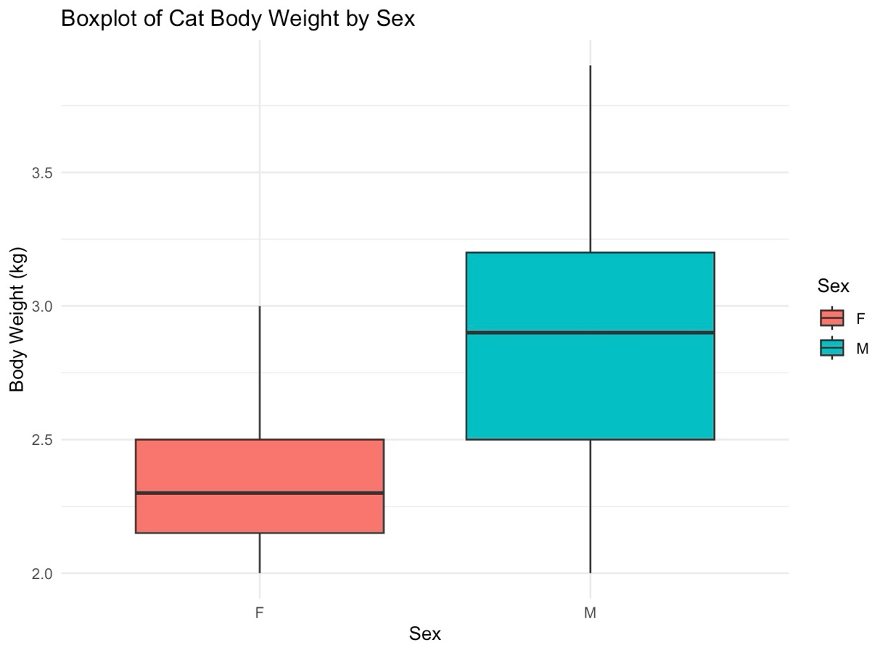
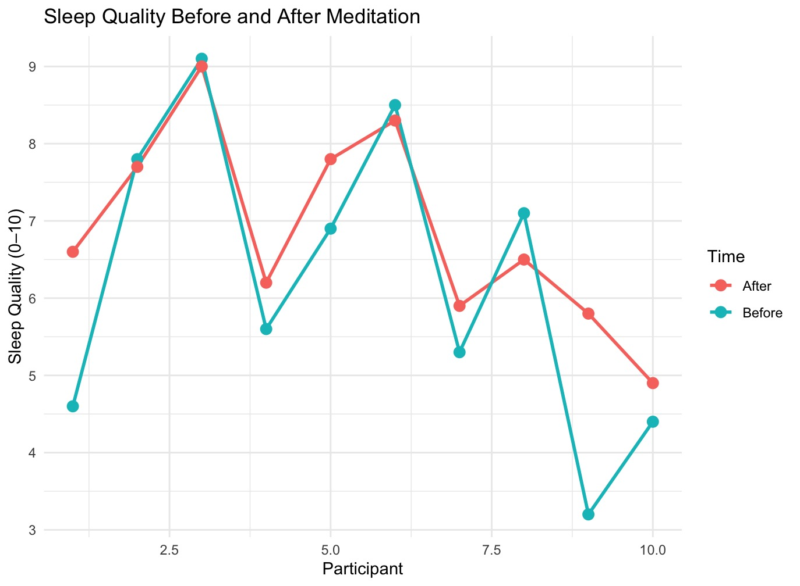

# Cat weight and meditation sleep: t-test study

Choosing the right t-test: comparing two groups, and comparing the same people before and after.

**Type:** Hypothesis testing · **Completed:** June 2025 · Northeastern University (ALY 6010)

[← All projects](../)

## What this project is about

This project applies two kinds of t-test to two questions. Do male and female cats differ in body weight? And does a meditation workshop improve students' sleep quality?

## Why it matters

Using the wrong statistical test is one of the most common analysis mistakes, and it can turn a real effect into a false one or the reverse. This project shows how to choose correctly between comparing two separate groups and comparing the same people before and after, using two small, clear examples.

## Dataset

- **`cats` dataset** from the MASS package: 144 cats, with sex, body weight (kg), and heart weight (g).
- **Sleep quality scores**: 10 students rated their sleep from 0 to 10 in the week before and the week after a meditation workshop.

## What I did

I completed this project on my own, from cleaning the data through to the final report.

1. **Cats:** split the data by sex and ran a Welch two-sample t-test, which doesn't assume equal variances.
2. **Sleep:** ran a one-sided paired t-test, since each student was measured twice.
3. Visualized the cats with a box plot, and the sleep scores with a before-and-after line plot and a histogram of the differences.

## Results

- Male cats were significantly heavier than female cats, 2.90 kg vs. 2.36 kg (t = 8.71, p < 0.0001).

- Sleep quality improved by an average of 0.62 points after the meditation workshop. The improvement was statistically significant at the 5% level (t = 1.95, p = 0.042).

## Takeaways

- Picking the right test matters: independent groups need a two-sample test, and repeated measurements on the same people need a paired test.
- The sleep result is significant but modest, and with only 10 students it should be confirmed on a larger group.

## Skills demonstrated

Welch two-sample t-test, paired t-test, one- vs. two-sided hypotheses, choosing the right test for the data, visualizing group and before-and-after comparisons

## Files

- [`report.docx`](report.docx): Written report
- [`t_tests.R`](t_tests.R): R script

## How to run it

Packages: `MASS`, `ggplot2`

No download needed: the cat data comes from the MASS package, and the sleep scores are entered directly in the script.
