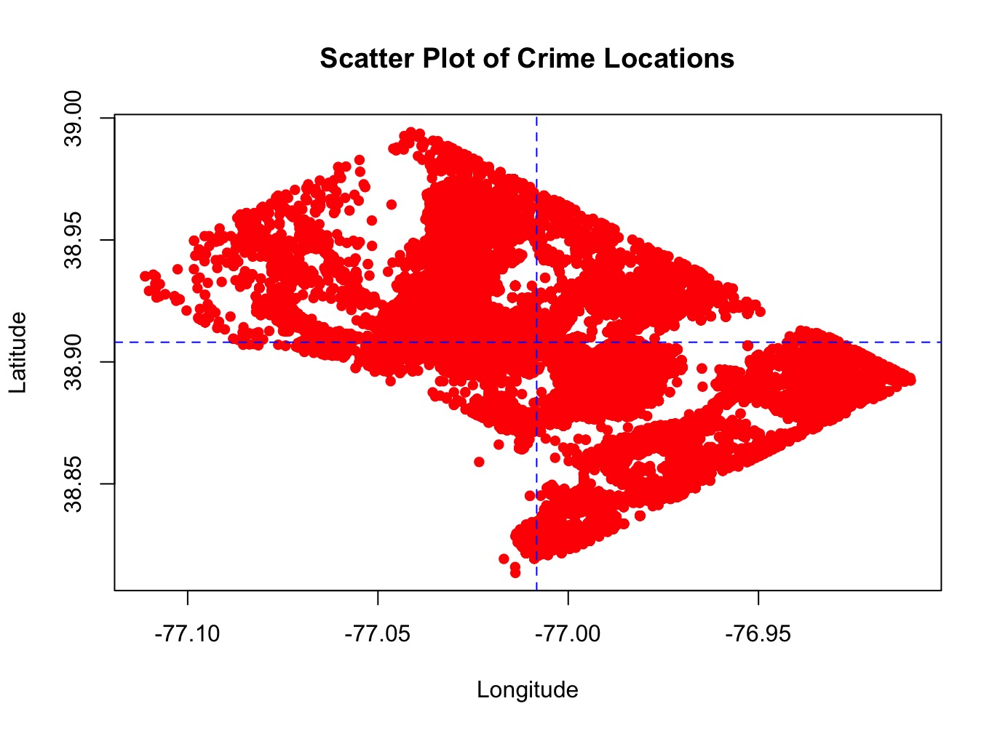
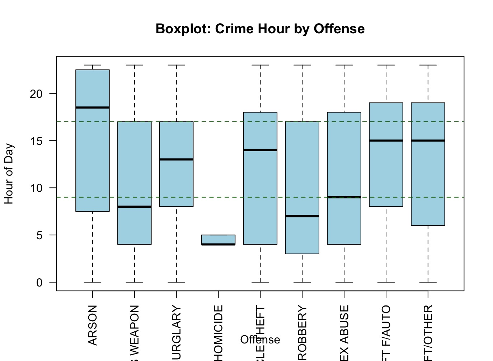

# Washington, D.C. crime incidents, 2024

When and where different crimes happen across the city.

**Type:** Exploratory analysis · **Completed:** May 2025 · Northeastern University (ALY 6010)

[← All projects](../)

## What this project is about

This project analyzes crime reported in Washington, D.C. during 2024 to understand which crimes are most common, when they tend to happen, and how they spread across the city. The findings can help police, city planners, and residents make better decisions about safety.

## Why it matters

Police departments and city planners have to decide where and when to put limited resources. Seeing that different crimes peak at different hours and cluster in specific places supports smarter patrol scheduling and prevention efforts.

## Dataset

**Crime Incidents in 2024**, Metropolitan Police Department (`Crime_Incidents_in_2024.csv`): 29,288 reports and 25 fields, including offense type, report time, latitude and longitude, ward, police district, and shift.

## What I did

I completed this project on my own, from cleaning the data through to the final report.

1. Cleaned column names and converted report times into a usable date-time format.
2. Created an hour-of-day variable for each incident.
3. Calculated descriptive statistics for the full dataset and for each offense type with `psych::describe()`.
4. Mapped incidents by latitude and longitude, and compared crime times by offense with jitter plots and box plots.

## Results

- Crimes were reported at every hour of the day, with an average report time around midday.
- Mapping the incidents showed clear geographic hotspots.

- Timing varied by offense: thefts tended to happen during working hours, while assaults and robberies were more common in the evening.

- Theft was by far the most common offense category.

## Takeaways

- Crime in D.C. is concentrated in place and in time, and the pattern differs by offense.
- That supports targeted patrols, matched to the times and places where specific crimes happen.

## Skills demonstrated

Descriptive statistics by group, date-time handling, geographic plotting with latitude and longitude, jitter plots and box plots, outlier detection

## Files

- [`dc_crime_analysis.R`](dc_crime_analysis.R): R script
- [`report.docx`](report.docx): Written report

## How to run it

Packages: `tidyverse`, `janitor`, `psych`, `lubridate`

Download `Crime_Incidents_in_2024.csv` from Open Data DC, place it in this folder, and run the script in R or RStudio.
