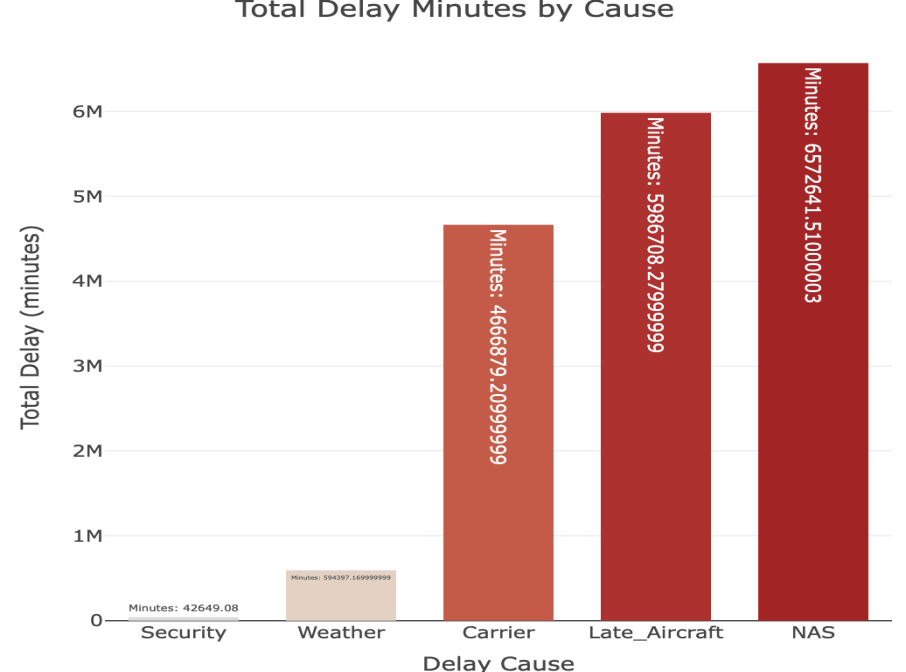
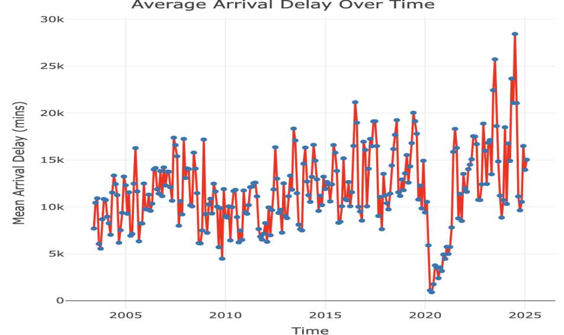

# Airline delays in the United States: exploratory analysis

What causes flight delays, and where and when are they worst?

**Type:** Exploratory analysis · **Completed:** May 2025 · Northeastern University (ALY 6010)

[← All projects](../)

## What this project is about

This exploratory analysis looks at airline delays at US airports to understand what causes them and how they vary by airline, airport, and time. The goal is to point airlines, airports, and regulators toward the problems most worth fixing.

## Why it matters

Flight delays cost airlines and passengers billions every year. Knowing which causes contribute the most delay time, and when delays peak, tells airlines, airports, and regulators where improvements would pay off most.

## Dataset

**Airline delay causes**, US Department of Transportation, Bureau of Transportation Statistics: 94,636 records and 21 fields. Each record covers one airline at one airport in one month, with arriving flights, delayed flights, cancellations, diversions, and delay counts and minutes broken down by cause (carrier, weather, National Aviation System, security, and late-arriving aircraft).

## What I did

I completed this project on my own, from cleaning the data through to the final report.

1. Imported the data and standardized column names.
2. Checked structure and missing values, and combined year and month into a single time variable.
3. Built descriptive statistics for the delay measures.
4. Visualized the busiest airports, the airlines with the most delays, total delay minutes by cause, delays by airline, and average delay over time.

## Results

- National Aviation System delays (air traffic control and airport operations) and late-arriving aircraft caused the most delay minutes, about 6.6 million and 6.0 million. Airline-caused delays came third at about 4.7 million. Weather and security were much smaller.

- Atlanta Hartsfield-Jackson was the busiest airport by arrivals.
- Southwest Airlines had the most delayed flights, at about 1.6 million.
- Average delays dropped sharply in 2020 and then climbed to new highs in the years that followed.

## Takeaways

- Most delay comes from system-level problems: air traffic congestion and delays that ripple from one flight to the next. These are bigger than weather.
- Fixing knock-on delays from late aircraft could have an outsized effect, because one late flight delays the next.

## Skills demonstrated

Exploratory data analysis on 94,636 records, data cleaning, building time variables, comparing categories, communicating findings with charts

## Files

- [`report.pdf`](report.pdf): Written report

## About the data

This milestone was completed as a written analysis, so only the report is included. The data is available from the Bureau of Transportation Statistics.
