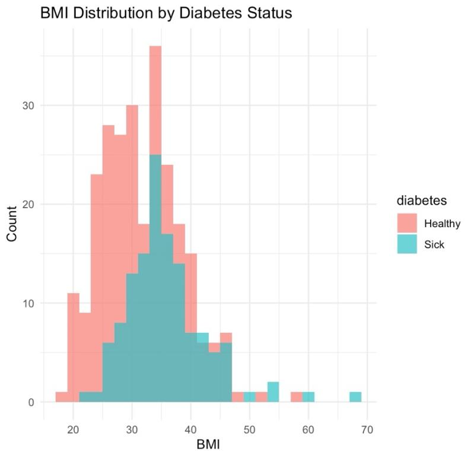
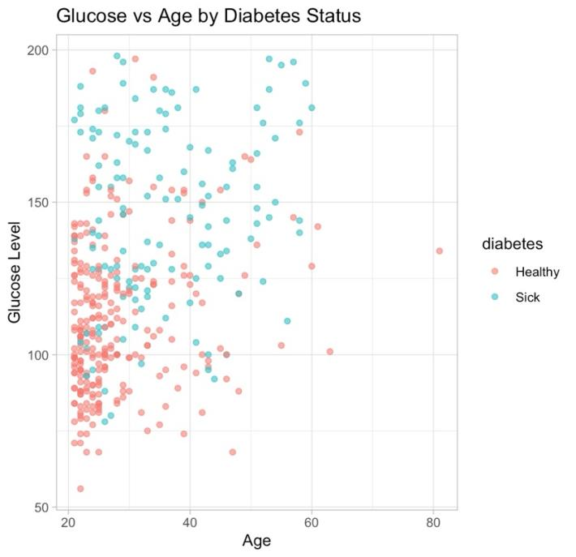

# Biometric indicators of diabetes risk

Which health measurements set diabetic patients apart? Glucose, BMI, and age stand out.

**Type:** Exploratory analysis · **Completed:** May 2025 · Northeastern University (ALY 6000)

[← All projects](../)

## What this project is about

This project explores a medical dataset of female patients from the Pima community to identify which health indicators are most associated with a diabetes diagnosis. The aim is to show which measurements matter most for screening.

## Why it matters

Early detection of diabetes depends on knowing which measurements to watch. This project shows which routine health indicators most clearly separate diabetic from non-diabetic patients, which is useful for screening. It also shows why careful data cleaning matters in healthcare data.

## Dataset

**Pima Indians Diabetes dataset** (`Diabetes.csv`): 768 female patients aged 21 and over, with pregnancies, plasma glucose, blood pressure, skinfold thickness, insulin, BMI, diabetes pedigree function, age, and diabetes status.

## What I did

I completed this project on my own, from cleaning the data through to the final report.

1. Cleaned column names, then replaced biologically impossible zero values (for example, a glucose or BMI of zero) with missing values.
2. Removed incomplete records, leaving 392 patients with full measurements (262 without diabetes, 130 with).
3. Created age groups (under 30, 30 to 49, 50 and over) and standard BMI categories (underweight, normal, overweight, obese).
4. Compared averages across groups and visualized the differences with histograms, scatter plots, box plots, and bar charts.

## Results

- Patients with diabetes had a higher average BMI than those without it in every age group.

- 110 of the 130 diabetic patients (85%) were in the obese category. Only 2 had a normal BMI.
- Average glucose rose with age, from 115 in patients under 30 to 155 in those 50 and over.

- Diabetic patients had higher average insulin (207 vs. 131 μU/mL) and skinfold thickness (33.0 vs. 27.3 mm).
- Diabetic patients were older on average.

## Takeaways

- Glucose and BMI are the clearest warning signs in this data, and age adds to the risk.
- Data cleaning mattered: about half the records had invalid zero values that would have distorted the results if left in.

## Skills demonstrated

Healthcare data cleaning (handling invalid values), feature engineering (age groups, BMI categories), grouped comparisons, multi-chart storytelling

## Files

- [`diabetes_risk_factors.R`](diabetes_risk_factors.R): R script
- [`report.pdf`](report.pdf): Written report

## How to run it

Packages: `janitor`, `dplyr`, `ggplot2`, `tidyr`, `knitr`

Download the dataset named above, place it in this folder, and run the script in R or RStudio. The script reads the file by name from the working directory.
