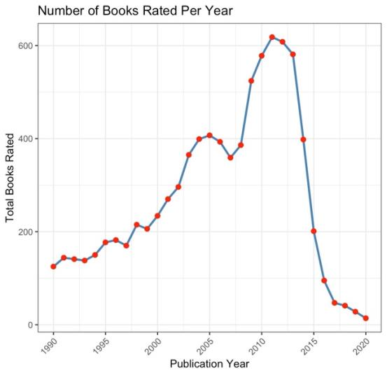
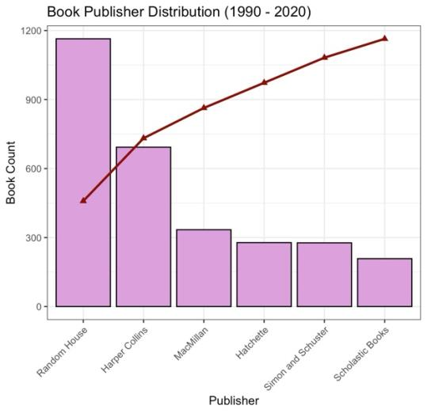

# Book publishing trends, 1990–2020

Three decades of book data reveal a crowded market controlled by a few giants.

**Type:** Exploratory analysis · **Completed:** April 2025 · Northeastern University (ALY 6000)

[← All projects](../)

## What this project is about

This project analyzes a dataset of books published between 1990 and 2020 to understand trends in publishing volume, which publishers dominate, which authors are most prolific, and how books are rated.

## Why it matters

For authors, small publishers, and anyone entering the market, it helps to know who really controls an industry. This project shows how concentrated publishing is, and that quality, as judged by readers, often comes from smaller players.

## Dataset

**Books dataset** (`books.csv`): book records with title, author, publisher, publication date, page count, average rating, and number of ratings.

## What I did

I completed this project on my own, from cleaning the data through to the final report.

1. Cleaned the data and parsed publication dates with `lubridate`.
2. Filtered to books published from 1990 to 2020.
3. Counted books by year, publisher, and author, and calculated cumulative and relative frequencies for the major publishers.
4. Built a Pareto chart, a relative frequency chart, a pie chart of market share, a histogram of ratings, a box plot of page counts, and a line chart of books per year.

## Results

- Publishing volume rose steadily and peaked in 2011, with 618 books. 2009 to 2013 was the busiest period, matching the rise of e-books and self-publishing.

- Nearly 2,000 publishers appeared in the data, but only six released at least 125 books. Random House alone published 1,164, about 39% of the output among those six.

- Terry Pratchett was the most prolific author with 28 books, followed by CLAMP and Karen Kingsbury with 27 each.
- Most books were rated between 3.5 and 4.5 out of 5, and most ran between about 224 and 405 pages.
- Some small publishers had the highest average ratings, even though the giants dominated volume.

## Takeaways

- Publishing follows a winner-takes-most pattern: many players, but a few control most of the output.
- Volume and quality are different stories. Smaller publishers can win on reader ratings.

## Skills demonstrated

Date parsing, frequency and cumulative-frequency analysis, Pareto analysis, market-share visualization, summarizing a large dataset into clear findings

## Files

- [`book_publishing_trends.R`](book_publishing_trends.R): R script
- [`report.pdf`](report.pdf): Written report

## How to run it

Packages: `janitor`, `lubridate`, `dplyr`, `ggplot2`, `knitr`

Download the dataset named above, place it in this folder, and run the script in R or RStudio. The script reads the file by name from the working directory.
