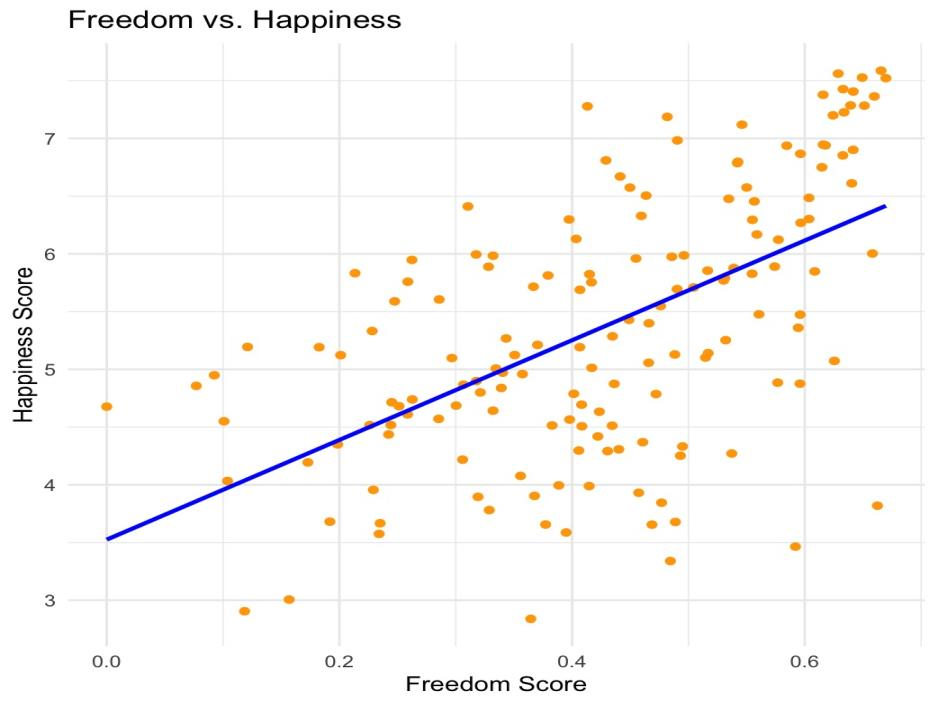
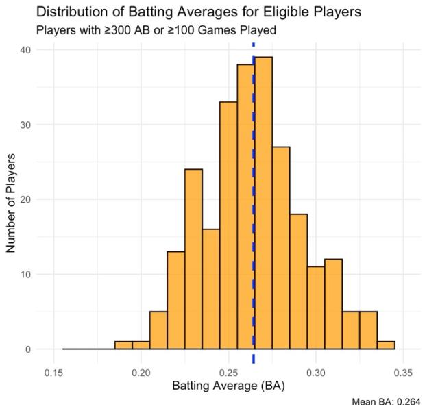

# World Happiness and MLB batting: exploratory analysis

Two exploratory analyses: how freedom relates to happiness across countries, and what separated the top hitters in the 1986 MLB season.

**Type:** Exploratory analysis · **Completed:** April 2025 · Northeastern University (ALY 6000)

[← All projects](../)

## What this project is about

Part 1 explores the 2015 World Happiness Report to see how happiness varies around the world and how it relates to people's sense of freedom. Part 2 explores 1986 Major League Baseball batting statistics to find the season's strongest performers and how different batting measures relate to each other.

## Why it matters

Both halves of this project are about finding what separates the top from the rest: which national conditions go with happier populations, and which statistics mark out elite hitters. The same exploratory approach works for any ranking or performance question.

## Dataset

- **2015 World Happiness Report** (`2015.csv`): one row per country, with happiness score, freedom, GDP per capita, family and social support, and life expectancy.
- **1986 MLB batting statistics** (`baseball.csv`): one row per player, with at-bats, hits, home runs, runs batted in, and walks.

## What I did

I completed this project on my own, from cleaning the data through to the final report.

1. Cleaned column names with `janitor::clean_names()`.
2. Plotted the distribution of happiness scores and the relationship between freedom and happiness, with a fitted regression line.
3. Ranked the top 10 happiest countries and the countries with the lowest freedom scores.
4. For baseball, calculated batting average (BA) and on-base percentage (OBP), and filtered to regular players (at least 300 at-bats or 100 games).
5. Ranked the top players by OBP, home runs, and RBI, and plotted the distribution of batting averages.

## Results

- Most countries had happiness scores between 4 and 7.
- Countries with more freedom tended to be happier, a clear positive relationship.

- Switzerland (7.59), Iceland (7.56), and Denmark (7.53) topped the happiness ranking. Nine of the top 10 were in Western Europe, North America, or Australia and New Zealand.
- Among regular MLB players in 1986, the average batting average was .264. Hitting above .300 was rare.

- Wade Boggs led the top 10 players by on-base percentage.

## Takeaways

- Freedom is one of the factors most closely tied to national happiness, alongside social support and economic stability.
- In baseball, a few players stand out at the top of each measure, and a .300 average really is an elite mark.

## Skills demonstrated

Exploratory data analysis, calculating derived metrics (batting average, on-base percentage), filtering and ranking, scatter plots with trend lines

## Files

- [`report.pdf`](report.pdf): Written report
- [`world_happiness_eda.R`](world_happiness_eda.R): R script

## How to run it

Packages: `dplyr`, `ggplot2`, `janitor`, `knitr`

Download the 2015 World Happiness Report (`2015.csv`) and the baseball dataset (`baseball.csv`), place them in this folder, and run the script in R or RStudio.
