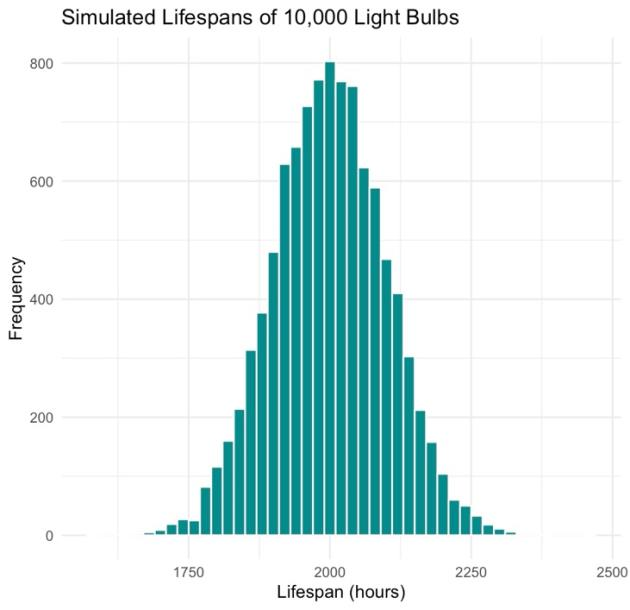
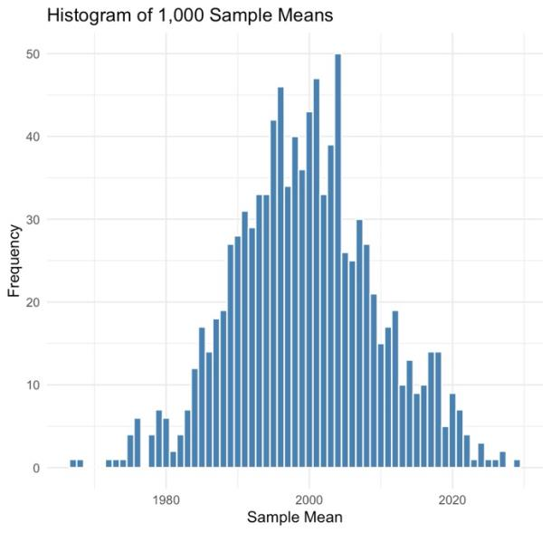

# Probability distributions in practice: staffing, quality control, and sports

Probability distributions applied to sports, call-center staffing, product quality, and penguin biology.

**Type:** Probability · **Completed:** May 2025 · Northeastern University (ALY 6000)

[← All projects](../)

## What this project is about

This project applies the three most common probability distributions to practical questions, then uses simulation to confirm the Central Limit Theorem and explores the real-world `palmerpenguins` dataset.

## Why it matters

Probability distributions turn uncertainty into planning numbers. This project applies them to decisions managers actually make: how many staff a call center needs to hit its target, and where to set a quality-control threshold for defective products.

## Dataset

- Simulated scenarios: a baseball series, call-center volumes, and light-bulb lifespans.
- **Palmer Penguins** (`palmerpenguins` package): 344 penguins across three species (152 Adelie, 124 Gentoo, 68 Chinstrap), with flipper length, bill depth, body mass, and sex.

## What I did

I completed this project on my own, from cleaning the data through to the final report.

1. **Binomial:** modeled a team's chances of winning games in a seven-game series.
2. **Poisson:** modeled calls handled per hour to see how staffing affects a call center's daily quota.
3. **Normal:** modeled light-bulb lifespans to set a defect threshold.
4. Simulated 1,000 sample means to test the Central Limit Theorem.
5. Explored penguin measurements with histograms, scatter plots, and summary tables.

## Results

- In the baseball model, the expected number of wins in seven games was about 4.55, with about a 31% chance of exactly five wins.
- In the call-center model, each employee handled about seven calls per hour. Losing even one person from a five-person team sharply cut the chance of hitting the 275-call daily target.
- About 95% of light bulbs were expected to last between 1,800 and 2,200 hours. The bottom 10%, below about 1,872 hours, were classed as defective.

- The 1,000 simulated sample means clustered tightly around the true mean of 2,000 hours, confirming the Central Limit Theorem.

- Adelie flipper lengths were roughly normal, and Gentoo penguins with longer flippers tended to have deeper bills.

## Takeaways

- The same few distributions can answer very different operational questions, from staffing to quality control.
- Simulation is a practical way to check that theory holds.

## Skills demonstrated

Binomial, Poisson, and normal distributions, simulation, Central Limit Theorem, applying statistics to staffing and quality decisions

## Files

- [`probability_distributions.R`](probability_distributions.R): R script
- [`report.pdf`](report.pdf): Written report

## How to run it

Packages: `dplyr`, `ggplot2`, `tidyr`, `janitor`, `palmerpenguins`, `knitr`

No download needed: the scenarios are simulated in the script, and the penguin data comes from the `palmerpenguins` package. Install the packages and run the script.
