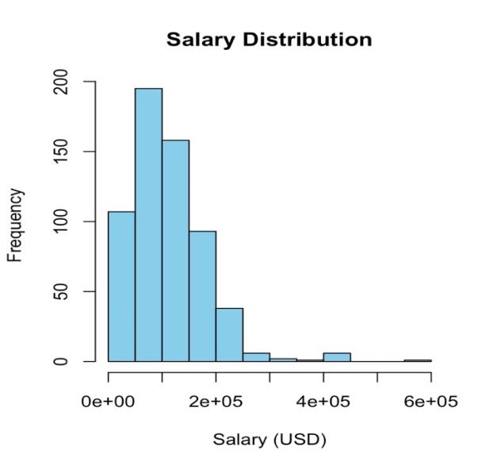
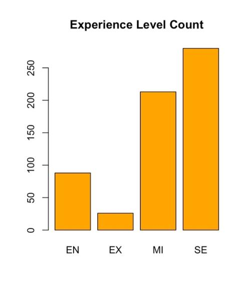

# Data science salaries: R fundamentals

Core R skills, from vectors to plots, applied to a real dataset of data science salaries.

**Type:** R fundamentals · **Completed:** April 2025 · Northeastern University (ALY 6000)

[← All projects](../)

## What this project is about

This was my first R project. The goal was to build a solid foundation in the language: arithmetic, creating and modifying vectors, indexing, logical filtering, summary statistics, and random number generation. I then applied those skills to a real dataset of data science job salaries to look at how pay varies by role and experience level.

## Why it matters

This was my first project in R. It builds the core skills every later project relies on, and applies them to a question many job seekers care about: what data science roles actually pay.

## Dataset

**Data science salaries** (`ds_salaries.csv`): 607 job records from 2020 to 2022, with job title, experience level, employment type, company size, remote ratio, and salary in USD.

## What I did

I completed this project on my own, from cleaning the data through to the final report.

1. Worked through 30 programming exercises covering vectors, indexing, Boolean filtering, sums, means, medians, cumulative sums, sorting, and seeded random numbers.
2. Loaded the salary dataset into a data frame and explored it with `summary()`.
3. Visualized the salary distribution with a histogram and the mix of experience levels with a bar chart.

## Results

- Salaries ranged widely, from about $2,900 to $600,000, with a median of about $101,600 and a mean of about $112,300. The mean sits above the median because a small number of very high salaries pull it up.

- Senior-level roles were the most common in the dataset, followed by mid-level. Entry-level and executive roles were much less represented.

## Takeaways

- Salary data is right-skewed, so the median is a better summary of typical pay than the mean.
- The dataset leans toward senior roles, which matters when using it to generalize about the job market.

## Skills demonstrated

R fundamentals (vectors, indexing, logical filtering), summary statistics, base R plotting, reading real data

## Files

- [`ds_salaries_analysis.R`](ds_salaries_analysis.R): R script
- [`report.pdf`](report.pdf): Written report

## How to run it

Packages: base R only

Download `ds_salaries.csv` (widely available on Kaggle), place it in this folder, and run the script in R or RStudio.
